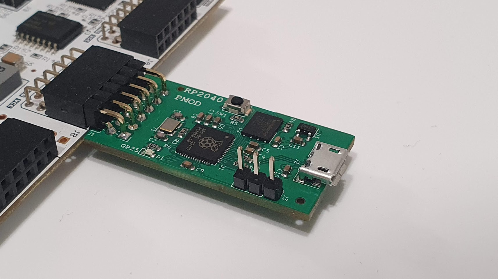
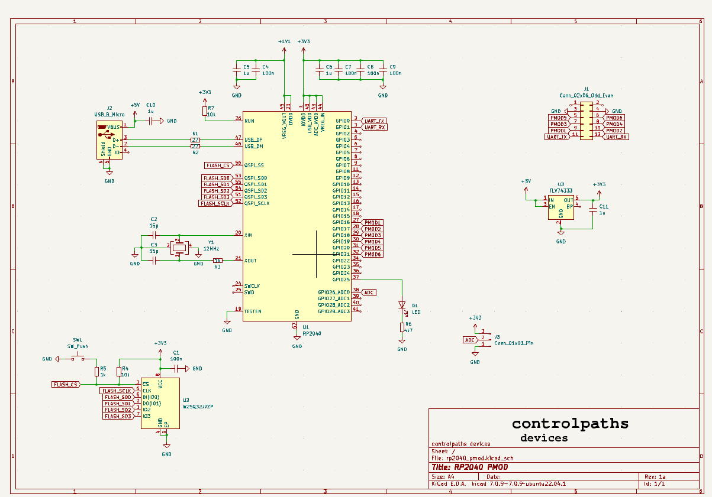
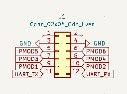
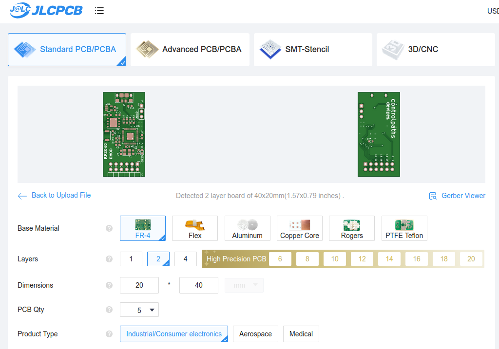

# RP2040 PMOD

The RP2040 PMOD is a PMOD-compatible board based on the [Raspberry PI](https://www.raspberrypi.com/) microcontroller, the [RP2040](https://www.raspberrypi.com/products/rp2040/)

The board has its own 3v3 LDO regulator, and the 3v3 pins of the PMOD connector are not connected.

PMOD connector.

## PMOD Connections

|PMOD PIN|Schematic|GPIO|Fuction|
|-|-|-|-|
|1|NC|--|--|
|2|NC|--|--|
|3|GND|--|GND|
|4|GND|--|GND|
|5|PMOD5|20|SPI0 RX / UART1 TX / I2C0 SDA|
|6|PMOD6|21|SPI0 CSn / UART1 RX / I2C0 SCL|
|7|PMOD3|18|SPI0 SCK / UART0 CTS / I2C1 SDA|
|8|PMOD4|19|SPI0 TX / UART0 RTS / I2C1 SCL|
|9|PMOD1|16|SPI0 RX / UART0 TX / I2C0 SDA|
|10|PMOD2|17|SPI0 CSn / UART0 RX / I2C0 SCL|
|11|UART_TX|0|SPI0 RX / UART0 TX / I2C0 SDA|
|12|UART_RX|1|SPI0 CSn / UART0 RX / I2C0 SCL|

## Examples

On the `/examples` folder you will find examples to program in this board. 

- [pico-uart-bridge](./examples/pico-uart-bridge/): Uses the RP2040 PMOD to generate two different UART interfaces in the PMOD PINS 5/6 and 11/12.

More examples soon!

## Get Yours

The RP2040 PMOD is open-source, so you can use the output files to manufacture your own in [JLCPCB](https://jlcpcb.com/?from=controlpath). You just need to compress the `output_files` directory, and upload it to [JLCPCB](https://jlcpcb.com/?from=controlpath). 

Remember to change the Surface Finish to **LeadFree HASL** to make your board ROHS compliant.

Then you have to add the PCB Assembly service and upload the [centroid](./kicad/output_files/rp2040_pmod-all-pos.csv) file, and the [BOM](./kicad/output_files/bom.csv). 

In a few days, you will receive your board at home. If you want just one RP2040 PMOD, contact me.
